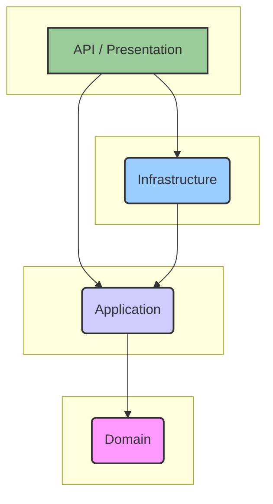
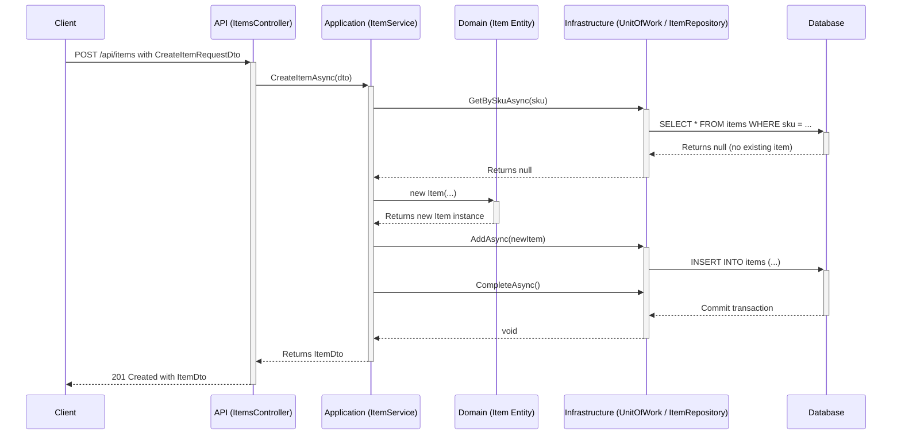

# StorIA-LITE Architecture

This document provides a detailed overview of the architecture of the StorIA-LITE system. It is intended for developers who want to understand the design principles, structure, and technology choices behind the project.

## 1. Guiding Principles

The architecture of StorIA-LITE is founded on the principles of **Clean Architecture**, as popularized by Robert C. Martin (Uncle Bob). This choice was made to ensure the system is:

*   **Independent of Frameworks**: The core business logic is not tied to any specific web framework like ASP.NET Core.
*   **Testable**: Each component can be tested in isolation, from the core business rules to the UI.
*   **Independent of UI**: The same business logic can be used to power a web API, a desktop application (MAUI, Tauri), or a mobile app.
*   **Independent of Database**: The core logic does not depend on a specific database technology. We can swap PostgreSQL for SQL Server with minimal changes to the core application.
*   **Maintainable and Scalable**: The clear separation of concerns makes the system easier to understand, maintain, and extend over time.

## 2. The Layers

The backend code is organized into four main projects, representing the layers of the Clean Architecture.

### 2.1. `Domain` Layer

This is the innermost layer and the heart of the application.

*   **Purpose**: Contains the enterprise-wide business logic and data structures.
*   **Contents**:
    *   **Entities**: Plain C# objects representing the core concepts of the business (e.g., `Item`, `User`, `Movement`). They contain properties and methods that enforce business rules (invariants). For example, the `Item` entity has methods like `IncreaseStock` and `DecreaseStock` that contain logic to prevent negative stock quantities.
    *   **Enums**: Enumerations that define a set of named constants for the domain (e.g., `MovementType`, `UserRole`).
    *   **Value Objects**: (Future) Objects that represent a descriptive aspect of the domain with no conceptual identity (e.g., `Address`).
*   **Dependencies**: This layer has **zero dependencies** on any other layer in the project. It is a pure C# class library.

### 2.2. `Application` Layer

This layer contains the application-specific business logic. It orchestrates the data flow to and from the domain entities to perform application use cases.

*   **Purpose**: Defines the jobs that the software is supposed to do.
*   **Contents**:
    *   **Services**: Classes that implement the application's use cases (e.g., `ItemService`, `AuthService`). They are called by the presentation layer and use the domain entities and repository interfaces to perform their tasks.
    *   **Interfaces**: Defines the contracts for the infrastructure layer's implementations. The most important are the repository interfaces (`IItemRepository`, `IUserRepository`) and the `IUnitOfWork` interface. This follows the **Dependency Inversion Principle**, where the Application layer defines the abstractions that the Infrastructure layer must implement.
    *   **DTOs (Data Transfer Objects)**: Simple classes used to transfer data between layers, especially between the presentation layer and the application layer. This prevents exposing the domain entities directly to the outside world.
    *   **Validators**: Classes that define validation rules for the DTOs using FluentValidation.
    *   **Mappers**: AutoMapper profiles for mapping between DTOs and domain entities.
*   **Dependencies**: Depends only on the `Domain` layer.

### 2.3. `Infrastructure` Layer

This layer is responsible for all the "details" and external concerns. It provides the implementation for the interfaces defined in the Application layer.

*   **Purpose**: To handle persistence, security, and communication with external systems.
*   **Contents**:
    *   **Persistence**:
        *   `AppDbContext`: The Entity Framework Core database context, which defines the database schema and entity configurations.
        *   **Repositories**: Concrete implementations of the repository interfaces defined in the Application layer (e.g., `ItemRepository`). They handle the actual database queries using Entity Framework Core.
        *   `UnitOfWork`: A class that coordinates the work of multiple repositories into a single transaction.
    *   **Security**:
        *   `JwtTokenGenerator`: A service for creating and managing JSON Web Tokens.
        *   `PasswordHasher`: A service for hashing and verifying passwords using BCrypt.
*   **Dependencies**: Depends on the `Application` layer.

### 2.4. `API` (Presentation) Layer

This is the outermost layer and the entry point for external clients.

*   **Purpose**: To expose the application's functionality to the outside world.
*   **Contents**:
    *   **Controllers**: ASP.NET Core API controllers that handle HTTP requests, call the application services, and return HTTP responses.
    *   `Program.cs`: The application's entry point, where all services are configured and injected (Dependency Injection), and the middleware pipeline is set up.
    *   **Middleware**: Custom or built-in middleware for handling concerns like exception handling, authentication, and CORS.
*   **Dependencies**: Depends on the `Application` and `Infrastructure` layers.

## 3. Data Flow Example: Creating a New Item

To illustrate how the layers work together, let's trace the process of creating a new inventory item.

1.  The **Client** sends a `POST` request to the `/api/items` endpoint with the item data in the request body (a `CreateItemRequestDto`).
2.  The **`ItemsController`** in the API layer receives the request. It calls the `CreateItemAsync` method on the `IItemService`.
3.  The **`ItemService`** in the Application layer first checks if an item with the same SKU already exists by calling the `GetBySkuAsync` method on the `IItemRepository` (via the `IUnitOfWork`).
4.  The **`ItemRepository`** in the Infrastructure layer executes a `SELECT` query against the database.
5.  Assuming no item exists, the `ItemService` creates a new **`Item` entity** (in the Domain layer) using its constructor, which enforces initial validation rules.
6.  The `ItemService` then calls the `AddAsync` method on the `IItemRepository` and `CompleteAsync` on the `IUnitOfWork`.
7.  The **`UnitOfWork`** and **`ItemRepository`** translate this into an `INSERT` statement and commit the transaction to the **Database**.
8.  The `ItemService` maps the newly created `Item` entity to an `ItemDto` and returns it to the `ItemsController`.
9.  The `ItemsController` returns a `201 Created` HTTP response to the client, with the `ItemDto` in the response body.

## 4. Client Architecture

The solution is designed to be client-agnostic. The backend API serves data that can be consumed by any type of client. The repository currently includes examples for:

*   **Web Client (React)**: A modern single-page application (SPA) built with React and Vite. It communicates with the backend API via HTTP requests.
*   **MAUI Client**: A placeholder for a future cross-platform desktop and mobile app using .NET MAUI.
*   **Tauri Client**: A placeholder for a future desktop app using Tauri, which leverages web technologies for the UI but provides a native shell.

This multi-client approach demonstrates the flexibility of having a decoupled backend API.
