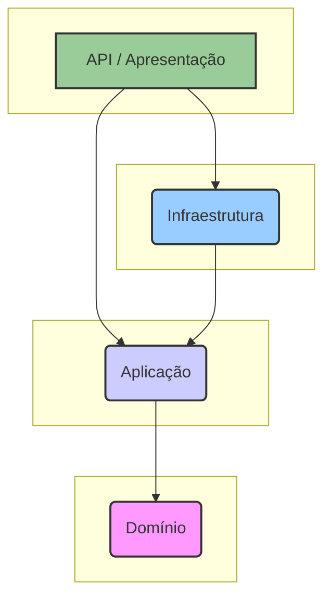
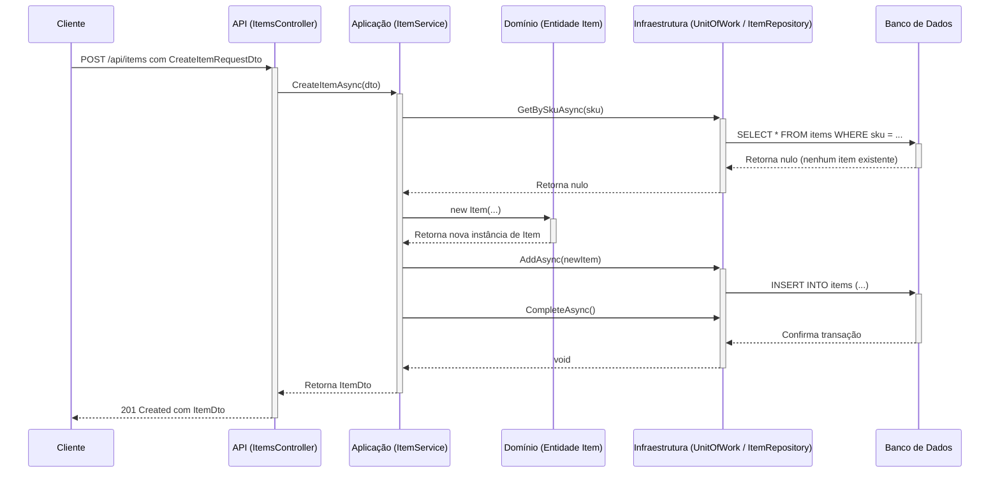

# Arquitetura do StorIA-LITE

Este documento fornece uma visão geral detalhada da arquitetura do sistema StorIA-LITE. Destina-se a desenvolvedores que desejam entender os princípios de design, a estrutura e as escolhas tecnológicas por trás do projeto.

## 1. Princípios Orientadores

A arquitetura do StorIA-LITE é baseada nos princípios da **Arquitetura Limpa (Clean Architecture)**, popularizada por Robert C. Martin (Uncle Bob). Essa escolha foi feita para garantir que o sistema seja:

*   **Independente de Frameworks**: A lógica de negócios principal não está vinculada a nenhum framework web específico como o ASP.NET Core.
*   **Testável**: Cada componente pode ser testado isoladamente, desde as regras de negócio principais até a UI.
*   **Independente de UI**: A mesma lógica de negócios pode ser usada para alimentar uma API web, um aplicativo de desktop (MAUI, Tauri) ou um aplicativo móvel.
*   **Independente de Banco de Dados**: A lógica principal não depende de uma tecnologia de banco de dados específica. Podemos trocar o PostgreSQL pelo SQL Server com alterações mínimas na aplicação principal.
*   **Manutenível e Escalável**: A clara separação de responsabilidades torna o sistema mais fácil de entender, manter e estender ao longo do tempo.

## 2. As Camadas

O código do backend é organizado em quatro projetos principais, representando as camadas da Arquitetura Limpa.

### 2.1. Camada de `Domain` (Domínio)

Esta é a camada mais interna e o coração da aplicação.

*   **Propósito**: Contém a lógica de negócios e as estruturas de dados de toda a empresa.
*   **Conteúdo**:
    *   **Entidades**: Objetos C# simples que representam os conceitos centrais do negócio (ex: `Item`, `User`, `Movement`). Eles contêm propriedades e métodos que impõem regras de negócio (invariantes). Por exemplo, a entidade `Item` possui métodos como `IncreaseStock` e `DecreaseStock` que contêm lógica para evitar quantidades de estoque negativas.
    *   **Enums**: Enumerações que definem um conjunto de constantes nomeadas para o domínio (ex: `MovementType`, `UserRole`).
    *   **Value Objects (Objetos de Valor)**: (Futuro) Objetos que representam um aspecto descritivo do domínio sem identidade conceitual (ex: `Address`).
*   **Dependências**: Esta camada tem **zero dependências** de qualquer outra camada no projeto. É uma biblioteca de classes C# pura.

### 2.2. Camada de `Application` (Aplicação)

Esta camada contém a lógica de negócios específica da aplicação. Ela orquestra o fluxo de dados de e para as entidades de domínio para executar os casos de uso da aplicação.

*   **Propósito**: Define as tarefas que o software deve realizar.
*   **Conteúdo**:
    *   **Serviços**: Classes que implementam os casos de uso da aplicação (ex: `ItemService`, `AuthService`). Elas são chamadas pela camada de apresentação e usam as entidades de domínio e as interfaces de repositório para realizar suas tarefas.
    *   **Interfaces**: Define os contratos para as implementações da camada de infraestrutura. As mais importantes são as interfaces de repositório (`IItemRepository`, `IUserRepository`) e a interface `IUnitOfWork`. Isso segue o **Princípio da Inversão de Dependência**, onde a camada de Aplicação define as abstrações que a camada de Infraestrutura deve implementar.
    *   **DTOs (Data Transfer Objects)**: Classes simples usadas para transferir dados entre camadas, especialmente entre a camada de apresentação e a camada de aplicação. Isso evita expor as entidades de domínio diretamente para o mundo exterior.
    *   **Validadores**: Classes que definem regras de validação para os DTOs usando FluentValidation.
    *   **Mappers**: Perfis do AutoMapper para mapear entre DTOs and entidades de domínio.
*   **Dependências**: Depende apenas da camada de `Domain`.

### 2.3. Camada de `Infrastructure` (Infraestrutura)

Esta camada é responsável por todos os "detalhes" e preocupações externas. Ela fornece a implementação para as interfaces definidas na camada de Aplicação.

*   **Propósito**: Lidar com persistência, segurança e comunicação com sistemas externos.
*   **Conteúdo**:
    *   **Persistência**:
        *   `AppDbContext`: O contexto de banco de dados do Entity Framework Core, que define o esquema do banco de dados e as configurações das entidades.
        *   **Repositórios**: Implementações concretas das interfaces de repositório definidas na camada de Aplicação (ex: `ItemRepository`). Eles lidam com as consultas reais ao banco de dados usando o Entity Framework Core.
        *   `UnitOfWork`: Uma classe que coordena o trabalho de múltiplos repositórios em uma única transação.
    *   **Segurança**:
        *   `JwtTokenGenerator`: Um serviço para criar e gerenciar JSON Web Tokens.
        *   `PasswordHasher`: Um serviço para fazer hash e verificar senhas usando BCrypt.
*   **Dependências**: Depende da camada de `Application`.

### 2.4. Camada de `API` (Apresentação)

Esta é a camada mais externa e o ponto de entrada para clientes externos.

*   **Propósito**: Expor a funcionalidade da aplicação para o mundo exterior.
*   **Conteúdo**:
    *   **Controladores**: Controladores de API ASP.NET Core que lidam com requisições HTTP, chamam os serviços da aplicação e retornam respostas HTTP.
    *   `Program.cs`: O ponto de entrada da aplicação, onde todos os serviços são configurados e injetados (Injeção de Dependência), e o pipeline de middleware é configurado.
    *   **Middleware**: Middleware personalizado ou integrado para lidar com preocupações como tratamento de exceções, autenticação e CORS.
*   **Dependências**: Depende das camadas de `Application` e `Infrastructure`.

## 3. Exemplo de Fluxo de Dados: Criando um Novo Item

Para ilustrar como as camadas trabalham juntas, vamos rastrear o processo de criação de um novo item de inventário.

1.  O **Cliente** envia uma requisição `POST` para o endpoint `/api/items` com os dados do item no corpo da requisição (um `CreateItemRequestDto`).
2.  O **`ItemsController`** na camada de API recebe a requisição. Ele chama o método `CreateItemAsync` no `IItemService`.
3.  O **`ItemService`** na camada de Aplicação primeiro verifica se um item com o mesmo SKU já existe, chamando o método `GetBySkuAsync` no `IItemRepository` (através do `IUnitOfWork`).
4.  O **`ItemRepository`** na camada de Infraestrutura executa uma consulta `SELECT` no banco de dados.
5.  Assumindo que nenhum item exista, o `ItemService` cria uma nova **entidade `Item`** (na camada de Domínio) usando seu construtor, que impõe regras de validação iniciais.
6.  O `ItemService` então chama o método `AddAsync` no `IItemRepository` e `CompleteAsync` no `IUnitOfWork`.
7.  O **`UnitOfWork`** e o **`ItemRepository`** traduzem isso em uma instrução `INSERT` e confirmam a transação no **Banco de Dados**.
8.  O `ItemService` mapeia a entidade `Item` recém-criada para um `ItemDto` e o retorna para o `ItemsController`.
9.  O `ItemsController` retorna uma resposta HTTP `201 Created` para o cliente, com o `ItemDto` no corpo da resposta.

## 4. Arquitetura do Cliente

A solução é projetada para ser agnóstica ao cliente. A API de backend serve dados que podem ser consumidos por qualquer tipo de cliente. O repositório atualmente inclui exemplos para:

*   **Cliente Web (React)**: Uma aplicação de página única (SPA) moderna construída com React e Vite. Ela se comunica com a API de backend através de requisições HTTP.
*   **Cliente MAUI**: Um placeholder para um futuro aplicativo de desktop e móvel multiplataforma usando .NET MAUI.
*   **Cliente Tauri**: Um placeholder para um futuro aplicativo de desktop usando Tauri, que aproveita tecnologias web para a UI, mas fornece um shell nativo.

Esta abordagem multi-cliente demonstra a flexibilidade de ter uma API de backend desacoplada.
